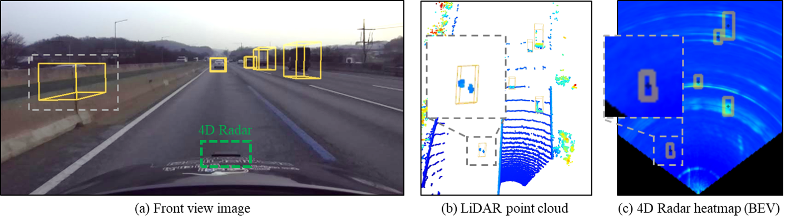

# K-Radar Dataset
This is the documentation for how to use our detection frameworks with K-Radar dataset.
We tested the K-Radar detection frameworks on the following environment:
* Python 3.8.13 (3.10+ does not support open3d.)
* Ubuntu 18.04/20.04
* Torch 1.11.0+cu113
* CUDA 11.3
* opencv 4.2.0.32
* open3d 0.15.2

## Preparing the Dataset

* Via our server (The total dataset)

1. To download the dataset, log in to <a href="http://QuickConnect.to/kaistavelab"> our server </a> with the following credentials: 
      ID       : kradards
      Password : Kradar2022
2. Go to the "File Station" folder, and download the dataset by right-click --> download.
   Note for Ubuntu user, there might be some error when unzipping the files. Please check the "readme_to_unzip_file_in_linux_system.txt".
3. After all files are downloaded, please arrange the workspace directory with the following structure:
```
KRadarFrameworks
      ├── tools
      ├── configs
      ├── datasets
      ├── models
      ├── pipelines
      ├── resources
      ├── uis
      ├── utils
      ├── logs
├── kradar_dataset (We handle the K-Radar dataset with multiple HDDs due to its large capacity.)
      ├── dir_2to5
            ├── 2
            ...
            ├── 5
      ├── dir_1to20
            ├── 1
            ├── 6
            ...
            ├── 20
      ├── dir_21to37
            ├── 21
            ...
            ├── 37
      ├── dir_38to58
            ├── 38
            ...
            ├── 58
```

* Via Google Drive Urls (A portion of the dataset for 4D Radar tensor or full 4D Radar point clouds dataset)

The `K-Radar` dataset is being uploaded to Google Drive. It will take time to upload our entire dataset.
The 4D Radar tensor is only available on our server because it is too large to upload to Google Drive. (We can charge for up to 2TB of Google Drive storage space.)
We provide camera images, Lidar point cloud, RTK-GPS, and Radar tensor (for network input) via Google Drive for flexibility.

<a href="https://drive.google.com/drive/folders/1IfKu-jKB1InBXmfacjMKQ4qTm8jiHrG_?usp=share_link"> Download link </a>

We note that the 4D Radar tensor data is large (as a fully populated 4-dimensional tensor, the DRAE Radar tensor requires 260MB assuming 32-bit float per cell, calculated as 64×256×107×37 * 32 / 8).
We are providing the radar tensor with power values removed along the Doppler axis (as rdr_polar_3d.zip) and Radar point clouds preprocessed at various densities (zip files in `from_rdr_poloar_3d` and `from_rdr_cube_xyz` in `RadarTensor` directory) through above Google Drive link ([https://drive.google.com/drive/folders/1IfKu-jKB1InBXmfacjMKQ4qTm8jiHrG_](https://drive.google.com/drive/folders/1IfKu-jKB1InBXmfacjMKQ4qTm8jiHrG_?usp=share_link)).
Additionally, we continue to provide the complete DRAE 4D Radar tensor dataset on hard drives for non-profit purposes to institutions that require it. We are receiving shipping requests, and we sincerely apologize if there have been any delays or inconveniences in the delivery process. We will continue to strive for the smooth provision of the dataset.

* Via Sending 4D raw data via shipping (The total dataset)

Given the considerable size of our research dataset, distributing it via Google Drive has proven difficult. Instead, we've been making it available through our local server. However, we're aware of the transfer speed limitations of our server and are seeking an alternative method.
If you're able to provide us with **a external hard drive of 16TB capacity or larger**, we can directly transfer the raw data to it and send it to your institution. The method of provision is flexible: you could opt for international shipping, make a purchase via Amazon, or consider other avenues.
It's important to emphasize that we're offering this service on a **non-profit** basis. Several esteemed research institutions (like Washington Univ., KAIST, NYU, and National Yang Ming Chiao Tung Univ.) as well as companies (like Motional and GM) have previously received data using this method.

For shipping-related inquiries, please contact woo-jin.jung@kaist.ac.kr and shyun@kaist.ac.kr.

After downloading all the dataset, please arrange the sequence directory with the following structure:
```
├── sequence_number (i.e., 1, 2, ..., 58)
      ├── cam_front
      ├── cam_left
      ├── cam_rear
      ├── cam_right
      ├── description.txt
      ├── info_calib
      ├── info_label
      ├── os1-128
      ├── os2-64
      ├── radar_zyx_cube
```

## Sequence composition

Each of the 58 sequences consists of listed files or folders as follows.
We add the explanation or usage next to each file or folder.
```
Sequence_number.zip (e.g. 1.zip)
├── cam-front: Front camera images
├── cam-left: Left camera images
├── cam-rear: Rear camera images
├── cam-right: Right camera images
├── cell_path: File to generate data from bag or radar ADC files (refer to the matlab file generation code.)
├── description.txt: Required for conditional evaluation (e.g., weather conditions)
├── info_calib: Calibration info btwn 4D radar and Lidar
├── info_label: Label of frames in txt
├── info_label_rev: not used
├── lidar_bev_image: Used for the labeling program
├── lidar_bev_image_origin: not used
├── lidar_point_cloud: Used for the labeling program
├── os1-128: High resolution mid-range Lidar point cloud
├── os2-64: Long-range Lidar point cloud (mainly used)
├── radar_bev_image: Used for the labeling program
├── radar_bev_image_origin: not used
├── radar_tesseract: 4D (DRAE) Radar tensor (250MB per frame) 
├── radar_zyx_cube: 3D (ZYX) Radar tensor (used for Sparse tensor generation)
├── time_info: Used for calibration
```

## Revising K-Radar Label

There are two primary revisions to our K-Radar label:

1. **Quality Enhancement**: The quality of the K-Radar label has been significantly improved. For instance, the size of the bounding boxes is now better suited to individual objects. Missing labels have been updated using camera images and LiDAR point cloud data. Furthermore, the tracking IDs of the objects have been amended. This revision was made possible by the Information Processing Lab, as acknowledged. We refer to this version of the updated label as v2.0. (The previous one is the label v1.0) You can download it using [the provided link](https://drive.google.com/file/d/1hEN7vdqoLaHZFf7woj5nj4hjpP88f7gU/view?usp=sharing).

2. **Visibility Discrimination**: We now categorize the visibility of each object based on its appearance in LiDAR and 4D Radar.


An example of a label of an object invisible to Radar but visible to LiDAR illustrated in gray dashed boxes in (a) the front view image, (b) LiDAR point cloud, and (c) 4D Radar heatmap.

Most 4D Radar object detection datasets use LiDAR-detected 3D bounding boxes as reference labels. However, a key difference between LiDAR and 4D Radar sensors is their respective installation locations. In detail, while LiDAR is typically installed on the roof of a vehicle, 4D Radar is placed in front of or directly above the vehicle bumper, as illustrated by the dashed green box in Figure above (a). As a result of this sensor placement disparity, such objects that are detected by LiDAR are not be visible to 4D Radar as shown in Figure above (b,c). This issue leads to the presence of labels that are invisible to Radar in 4D Radar datasets, but visible in LiDAR measurements. Such inconsistencies can negatively impact the performance of 4D Radar object detection neural networks, resulting in a number of false alarms. To address this issue, we distinguish labels that are invisible to Radar and we demonstrate this revision can improve the performance of the 4D Radar object detection network as shown in Model Zoo. We refer to this version of the updated label as v2.1. The label is accessible in the `tools/revise_label` directory.

## Calibration

TODO
