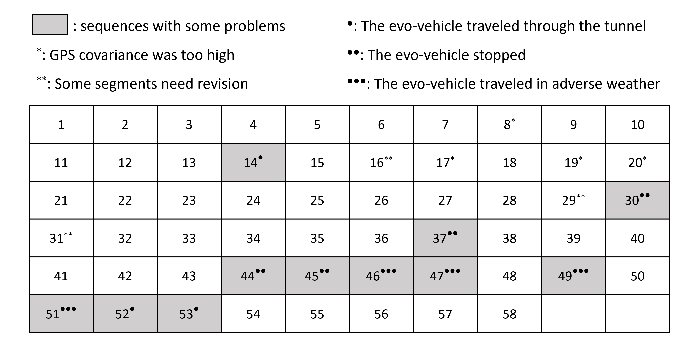

# Odometry

This document pertains to the subject of odometry. You can find the odometry data for each sequence in `K-Radar/resources/odometry`, which is in the <a href="https://www.cvlibs.net/datasets/kitti/eval_odometry.php">KITTI</a>. Due to the high covariance values of the IMU, integrating the IMU's rotational information with the GPS (x, y, z) data is challenging. Therefore, the odometry data has been obtained using <a href="https://github.com/RobustFieldAutonomyLab/LeGO-LOAM">LeGO-LOAM</a>.

## Introduction
All odometry data utilizes results from LeGO-LOAM, as well as GPS and camera data. Values obtained from the GPS are used to determine how similar they are to the results from LeGO-LOAM, and the camera data is used for qualitative assessment. The initial pose for all sequences has been set to the identity matrix due to security concerns. Below is an image representing the odometry of the first sequence based on LeGO-LOAM results and GPS measurements:

  

The odometry data for all sequences is based on the info_label of the K-Radar dataset. This means that in some sequences, there may be fewer odometry poses than there are lidar frames. When using odometry, **please refer to the info_label to determine which radar and lidar frames correspond to which odometry frames**. Below is an image representing the odometry of the second sequence based on LeGO-LOAM results and GPS measurements:

  

Additionally, in some sequences, the covariance of the GPS is very high. In such cases, the results from LeGO-LOAM are used as the odometry for that sequence instead of the GPS. Below is an image representing the odometry of the seventeenth sequence based on LeGO-LOAM results and GPS measurements:

  

## Available Sequences

In some sequences, the vehicle passes through tunnels or travels in adverse weather conditions, significantly degrading the performance of LeGO-LOAM. In other sequences, the vehicle remains stationary, resulting in odometry data that appears as a single point. The table below lists the sequences available for experiments with odometry.

  

## Visualization

We provide code to visualize the odometry data from .txt files, available in `K-Radar/utils/util_odometry.py`. To run this code, you need to install <a href="https://pytorch.org/get-started/locally/">torch</a> and <a href="https://github.com/facebookresearch/pytorch3d/tree/main">pytorch3d</a>. Below is the result of executing this function about the odometry of the first sequence.

  

