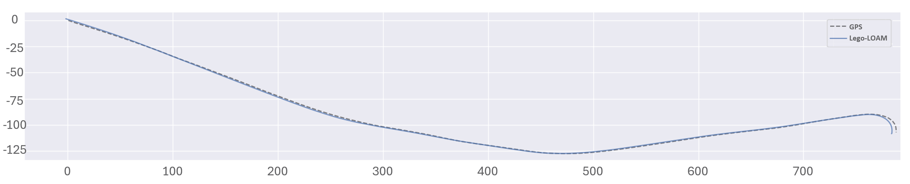
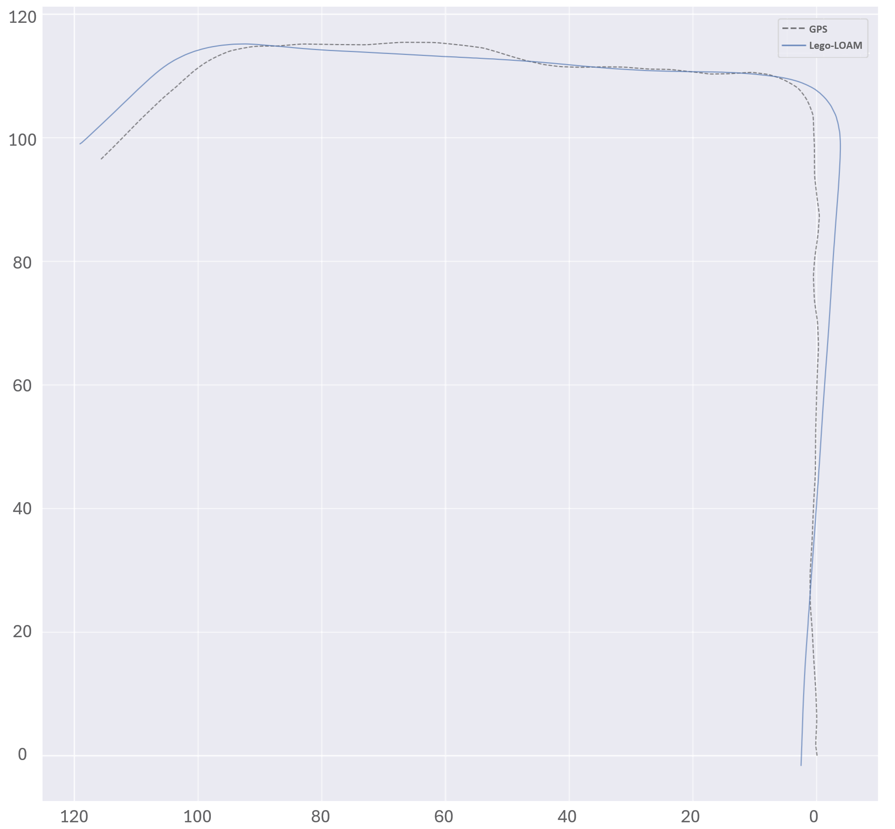
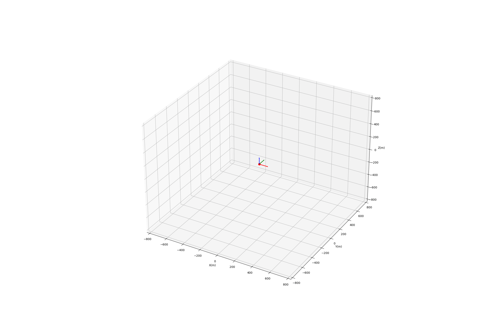

# Odometry

This document is about odometry in the K-Radar dataset. You can find the odometry labels in `K-Radar/resources/odometry/gt`, which is in the format of [KITTI](https://www.cvlibs.net/datasets/kitti/eval_odometry.php). The odometry labels have been generated using [LeGO-LOAM](https://github.com/RobustFieldAutonomyLab/LeGO-LOAM), which uses 360-degree LiDAR point clouds.

Additionally, you can use the `K-Radar/resources/odometry/gt_rel` file, which contains relative pose information. This file is derived from the ground truth (gt) and its format is (qw, qx, qy, qz, tx, ty, tz), where qw, qx, qy, qz represent quaternions and tx, ty, tz represent translations of relative frames. Timestamps and corresponding (relative) GPS (x, y, and z) information are provided in `K-Radar/resources/odometry/gps`.

All odometry labels utilize LeGO-LOAM, as well as GPS and camera data for qualitative assessment. Due to security concerns, the initial pose for all sequences has been set to the identity matrix. Below is an image representing the odometry of the first sequence based on LeGO-LOAM results and GPS measurements:

  

The odometry data for all sequences is based on the info_label of the K-Radar dataset. Consequently, some sequences may have fewer odometry poses than the number of lidar frames. When using odometry, please refer to the info_label to determine which radar and lidar frames correspond to which odometry frames. Below is an image representing the odometry of the second sequence based on LeGO-LOAM results and GPS measurements:

  

In some sequences, the GPS covariance is very high. In such cases, the results from LeGO-LOAM are used as the odometry for that sequence instead of the GPS. Below is an image representing the odometry of the seventeenth sequence based on LeGO-LOAM results and GPS measurements:

  

## Detailed information of sequences

In some sequences, the vehicle passes through tunnels or travels in adverse weather conditions, significantly degrading the performance of LeGO-LOAM. The table below lists the sequences which require special attention for odometry experiments:

  

## Visualization

We provide code to visualize the odometry from .txt files, available in `K-Radar/utils/util_odometry.py`. To run this code, please install [torch](https://pytorch.org/get-started/locally/) and [pytorch3d](https://github.com/facebookresearch/pytorch3d/tree/main). Below is the result of executing this function for the odometry of the first sequence:

  

## IMU

The IMU data for K-Radar can be found [here](https://drive.google.com/drive/folders/1iNdsVoe88kXAQ_xcMrEegp0FR6A5x_NW). The topic `/os_cloud_node_1/imu` contains IMU data from the Ouster 128-channel LiDAR sensor, and `/os_cloud_node_2/imu` contains IMU data from the Ouster 64-channel LiDAR sensor.
