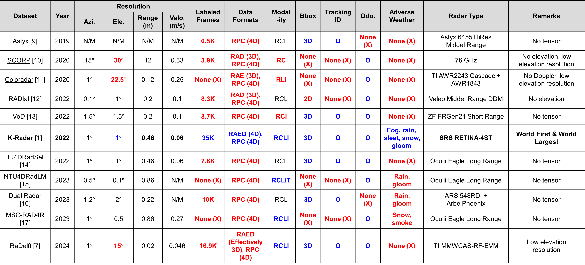

# Uniqueness of K-Radar  
K-Radar is the **world’s largest** publicly available 4D radar dataset for autonomous driving, with the **highest number of labeled frames** among existing datasets. It is also the **world’s first** to provide full **RAED (Range–Azimuth–Elevation–Doppler)** tensor data without any loss of dimensionality. Among 4D radar datasets, **K-Radar** features the **most diverse adverse weather scenarios**, making it a uniquely comprehensive resource for robust perception research.

The characteristics of existing 4D radar datasets are as follows:     

1. Most datasets provide **sparse point cloud representations** pre-processed from raw radar tensors. This sparsity leads to degraded 3D object detection performance, which is why recent works are shifting towards direct tensor-based methods [1–6].   

2. Even when radar data is released in tensor form, most datasets include only **partial RAED dimensions (2D or 3D tensor)**, despite being collected using full 4D radar sensors [2, 7, 8].    

3. To date, only **K-Radar [1]** and **RaDelft [7]** provide tensor data across all RAED dimensions. However, RaDelft has relatively low elevation resolution, which limits its ability to capture detailed height information [7]. In addition, **K-Radar** is the **largest** 4D radar dataset currently available [2, 8].   

For points (1) and (2), it is assumed that most 4D radar hardware providers restricted external release of raw tensor data due to **technology protection and security policies**, which made it difficult to access complete 4D tensor.   

K-Radar overcame these technical and policy barriers by **publicly releasing full 4D tensor data for the first time**, enabling high-quality training for more accurate and robust object detection and tracking.    

---

## Available Public 4D Radar Datasets (as of 2025.09.09) [1-17]

> **Note:**  
> *Azi.* = Azimuth, *Ele.* = Elevation, *Velo.* = Velocity (Doppler), *Odo.* = Odometry, *N/M* = Not Mentioned  
> *RPC* = Radar Point Cloud. Data formats: *R/A/E/D* = Range / Azimuth / Elevation / Doppler.  
> Sensor modalities: *R* = Radar, *C* = Camera, *L* = LiDAR, *I* = IMU, *T* = Thermal Camera.
> Tensor datasets are indicated with _underlines_.
 
> **Point Cloud**: Astyx [9], VoD [13], TJ4DRadSet [14], NTU4DRadLM [15], Dual Radar [16], MSC-RAD4R [17]    
> **3D Tensor**: SCORP [10], ColoRadar [11], RADIaL [12], RaDelft *(Effectively 3D)* [7]    
> **4D Tensor**: **K-Radar** [1]    
 
---
- Datasets with low elevation resolution are considered **Effectively 3D**, even if all RAED dimensions are included, as they are limited in capturing detailed height information.   
- **K-Radar** is the **world’s first** dataset to publicly release full RAED 4D radar tensors.   
- With a total of **35K labeled frames**, it is the  **largest number of labeled frames** among publicly available 4D radar datasets.
- It also provides the **largest number of frames in 4D radar tensor dataset**.
- To the best of our knowledge, **K-Radar** provides full RAED tensors (~300 MB per frame) and the largest number of labeled frames among 4D radar datasets, resulting in a total size of ~16 TB — making it likely **the largest 4D radar dataset** available.
- Among 4D radar datasets, **K-Radar** includes the **most diverse adverse weather scenarios** [8].     
- With these unique features, **K-Radar has been requested by more than 65 leading institutions worldwide** and has made significant contributions to advancing autonomous driving research with 4D radar.    

---

## References
[1] Paek, Dong-Hee, Seung-Hyun Kong, and Kevin Tirta Wijaya. "K-radar: 4d radar object detection for autonomous driving in various weather conditions." Advances in Neural Information Processing Systems 35 (2022): 3819-3829.   
[2] Kong, Seung-Hyun, Dong-Hee Paek, and Sangyeong Lee. "Rtnh+: Enhanced 4d radar object detection network using two-level preprocessing and vertical encoding." IEEE Transactions on Intelligent Vehicles (2024).   
[3] Ding, Fangqiang, et al. "Radarocc: Robust 3d occupancy prediction with 4d imaging radar." Advances in Neural Information Processing Systems 37 (2024): 101589-101617.   
[4] Cheng, Jen-Hao, et al. "Centerradarnet: Joint 3d object detection and tracking framework using 4d fmcw radar." 2024 IEEE International Conference on Image Processing (ICIP). IEEE, 2024.   
[5] Fent, Felix, Andras Palffy, and Holger Caesar. "Dpft: Dual perspective fusion transformer for camera-radar-based object detection." IEEE Transactions on Intelligent Vehicles (2024).   
[6] Liu, Yang, et al. "Echoes beyond points: Unleashing the power of raw radar data in multi-modality fusion." Advances in Neural Information Processing Systems 36 (2023): 53964-53982.   
[7] Roldan, Ignacio, et al. "A deep automotive radar detector using the RaDelft dataset." *IEEE Transactions on Radar Systems* (2024).      
[8] Peng, Xiangyuan, et al. "4D mmWave Radar in Adverse Environments for Autonomous Driving: A Survey." arXiv e-prints (2025): arXiv-2503.   
[9] Meyer, Michael, and Georg Kuschk. "Automotive radar dataset for deep learning based 3d object detection." 2019 16th european radar conference (EuRAD). IEEE, 2019.   
[10] Nowruzi, Farzan Erlik, et al. "Deep open space segmentation using automotive radar." 2020 IEEE MTT-S International Conference on Microwaves for Intelligent Mobility (ICMIM). IEEE, 2020.   
[11] Kramer, Andrew, et al. "Coloradar: The direct 3d millimeter wave radar dataset." The International Journal of Robotics Research 41.4 (2022): 351-360.   
[12] Rebut, Julien, et al. "Raw high-definition radar for multi-task learning." Proceedings of the IEEE/CVF Conference on Computer Vision and Pattern Recognition. 2022.   
[13] Palffy, Andras, et al. "Multi-class road user detection with 3+ 1d radar in the view-of-delft dataset." IEEE Robotics and Automation Letters 7.2 (2022): 4961-4968.   
[14] Zheng, Lianqing, et al. "TJ4DRadSet: A 4D radar dataset for autonomous driving." 2022 IEEE 25th International Conference on Intelligent Transportation Systems (ITSC). IEEE, 2022.   
[15] Zhang, Jun, et al. "Ntu4dradlm: 4d radar-centric multi-modal dataset for localization and mapping." 2023 IEEE 26th International Conference on Intelligent Transportation Systems (ITSC). IEEE, 2023.   
[16] Zhang, Xinyu, et al. "Dual radar: A multi-modal dataset with dual 4d radar for autononous driving." Scientific data 12.1 (2025): 439.   
[17] Choi, Minseong, et al. "Msc-rad4r: Ros-based automotive dataset with 4d radar." IEEE Robotics and Automation Letters 8.11 (2023): 7194-7201.
