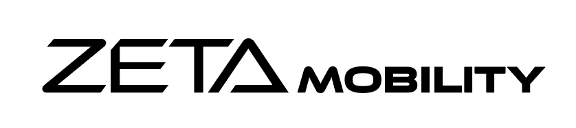
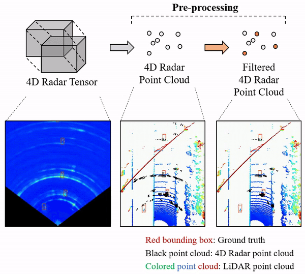
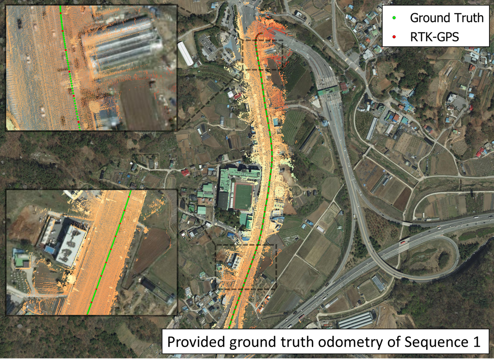

<p align="center">
  
</p>

`KAIST-Radar (K-Radar)` (provided by ['AVELab'](http://ave.kaist.ac.kr/)) is a novel large-scale object detection dataset and benchmark that contains 35K frames of 4D radar tensor (4DRT) data with power measurements along the Doppler, range, azimuth, and elevation dimensions, together with carefully annotated 3D bounding box labels of objects on the roads. K-Radar includes challenging driving conditions such as adverse weathers (fog, rain, and snow) on various road structures (urban, suburban roads, alleyways, and highways). In addition to the 4DRT, we provide auxiliary measurements from carefully calibrated high-resolution Lidars, surround stereo cameras, and RTK-GPS. This repository provides the `K-Radar` dataset, annotation tool for 3d bounding boxes, and the visualization tool for showing the inference results and calibrating the sensors.


The URLs listed below are useful for using the K-Radar dataset and benchmark:
* <a href="https://arxiv.org/abs/2206.08171"> K-Radar paper and appendix </a>
* <a href="https://arxiv.org/abs/2303.06342"> 4D radar object detection network of input with various density </a>
* <a href="https://arxiv.org/abs/2310.17659"> Enhanced network for 4D radar using two-stage pre-processing </a>
* <a href="https://github.com/kaist-avelab/K-Radar_auto-labeling"> Repository of Auto-labeling for 4D radar </a>
* <a href=""> Repository of Odometry for 4D radar </a>
* <a href="https://www.youtube.com/watch?v=TZh5i2eLp1k"> The video clip that shows each sensor measurement dynamically changing during driving under the heavy snow condition </a>
* <a href="https://www.youtube.com/watch?v=ylG0USHCBpU"> The video clip that shows the 4D radar tensor & Lidar point cloud (LPC) calibration and annotation process </a>
* <a href="https://www.youtube.com/watch?v=ILlBJJpm4_4"> The video clip that shows the annotation process in the absence of LPC measurements of objects  </a>
* <a href="https://www.youtube.com/watch?v=U4qkaMSJOds"> The video clip that shows calibration results </a>
* <a href="https://www.youtube.com/watch?v=MrFPvO1ZjTY"> The video clip that shows the GUI-based program for visualization and neural network inference </a>
* <a href="https://www.youtube.com/watch?v=8mqxf58_ZAk"> The video clip that shows the information on tracking for multiple objects on the roads </a>

## Uniqueness of K-Radar: The World's First and Largest 4DRT

K-Radar is the **world’s first** and **largest** publicly available autonomous driving 4D radar dataset that provides full **RAED (Range–Azimuth–Elevation–Doppler)** data as a **4D radar tensor (4DRT)** without any loss of dimensionality, and features the **most diverse adverse weather** scenarios among existing datasets.

Comparison of characteristics of existing 4D radar datasets is as follows:
1) Most provide **point cloud formats** that deliver a sparse representation after pre-processing of raw radar tensors data, which leads to performance degradation in 3D object detection.
2) Even when 4D radar data is collected in tensor format, as shown in the [`Uniqueness of K-Radar`](./docs/uniqueness.md) page, released datasets include only **partial RAED dimensions (2D or 3D tensor)**.
3) To date, **K-Radar** and **RaDelft** provide tensor data across all RAED dimensions (4D), with **K-Radar being the largest dataset** in terms of scale.

it is widely understood that most 4D radar hardware providers restricted external release of raw tensor data due to **technology protection and security policies**, which made it difficult to open a complete 4D tensor dataset to public.

On the contrary, K-Radar overcame these technical and policy barriers by **publicly releasing full 4D tensor data for the first time**, enabling high-quality training for more accurate and robust object detection and tracking.

More details on the unique features of K-Radar, including the full references for these claims, can be found on the [`Uniqueness of K-Radar`](./docs/uniqueness.md) page.

## License and Commercialization Inquiries

The `K-Radar` dataset is published under the CC BY-NC-ND License, and all codes are published under the Apache License 2.0.

The technologies in this repository have been developed by [`AVELab`](http://ave.kaist.ac.kr/) and are being commercialized by [`Zeta Mobility`](https://zetamobility-company.imweb.me/). For commercialization inquiries, please contact [`Zeta Mobility`](https://zetamobility-company.imweb.me/) (e-mail: zeta@zetamobility.com).

<p align="center">
  
</p>

# K-Radar Dataset

For the preparation of the dataset and pipeline, please refer to the following document: [Dataset Preparation Guide](/docs/dataset.md).

We provide the K-Radar dataset in three ways to ensure effective deployment of the large-sized data (total 15TB):

1. Access to the total dataset via our local server
2. A portion of the dataset via Google Drive
3. The total dataset via shipped HDD (Hard Disk Drive)

For more details, please refer to [the dataset documentation](/docs/dataset.md).

## Sensor Fusion

For the preparation and quantitative results of the camera, LiDAR, and 4D radar sensor fusion, please refer to the following document: [Sensor Fusion Pipeline Guide](/docs/sensor_fusion.md).

<p align="center">
  
  
</p>

The images above showcase qualitative results, with yellow boxes representing detected objects from our sensor fusion AI (camera + LiDAR + 4D radar), which we refer to as [Availability-aware Sensor Fusion (ASF)](https://arxiv.org/abs/2503.07029). From left to right, the images depict: (1) front-facing camera images, (2) LiDAR point clouds, (3) 4D radar tensors, and (4) sensor attention maps (SAMs). ASF stands out with three key advantages: **sensor availability awareness** that maintains performance even when sensors fail or degrade in adverse conditions by automatically prioritizing available sensors (in the SAMs, red, green, and blue represent attention scores for Camera, LiDAR, and 4D radar, with predominantly blue SAMs in adverse weather indicating 4D radar automatically received the highest attention); **efficient computation structure** with minimal memory usage (1.5-1.6GB) and high processing speeds (13.5-20.5Hz); and **superior detection performance** (87.4% AP3D at IoU=0.3 and 73.6% AP3D at IoU=0.5) even including challenging weather conditions. For more details, please refer to [the paper](https://arxiv.org/abs/2503.07029).

## Detection & Tracking

For the preparation and quantitative results of the 4D radar-based object detection, please refer to the following document: [Detection Pipeline Guide](/docs/detection.md).

<p align="center">
  
  
  
</p>

The images above showcase qualitative results, with green boxes representing detected objects using 4D radar. From left to right, the images depict (1) front-facing camera images (for reference), (2) LiDAR point clouds (for reference), and (3) 4D radar tensors (input for the neural network).
Note that the camera images and LiDAR point clouds are shown for reference purposes only, and the bounding boxes from the 4D radar-only detection are projected onto these visualizations.

For the preparation and quantitative results of the 4D radar-based object tracking, please refer to the following document: [Tracking Pipeline Guide](/docs/tracking.md).

## Pre-processing

For the preparation and quantitative results of the pre-processing for 4D radar, please refer to the following document: [Pre-processing Pipeline Guide](/docs/preprocessing.md).

<p align="center">
  
</p>

As shown in the figure above, the pre-processing of 4D radar consists of two stages. The first stage extracts the main measurements with high power from the 4D radar tensor (e.g., percentile in RTNH and CFAR in common), while the second stage removes noise from the first stage output. In the first stage, it is important to exclude peripheral measurements with low power and extract measurements with an appropriate density (typically 3~10%) to allow the detection network to recognize the shape of the object (refer to <a href="https://arxiv.org/abs/2303.06342">the paper</a>). However, extracting measurements at this density introduces noise called sidelobe, which interferes with precise localization of the object, as shown in the figure above. Therefore, pre-processing that indicates sidelobe to the network is essential, and applying this alone greatly improves detection performance, particularly the localization performance of objects (refer to <a href="https://ieeexplore.ieee.org/document/10599871">the paper</a>). For quantitative results and pre-processed data, please refer to [the pre-processing document](/docs/preprocessing.md).

## Auto-labeling

For the preparation and quantitative results of the auto-labeling for 4D radar, please refer to the following document: [Auto-labeling Pipeline Guide](/docs/labeling.md).

<p align="center">
  
</p>

The figure above shows the auto-labeling results for six road environments in the K-Radar dataset. Each cell, from left to right, displays the handmade labels, the detection results of the 4D radar detection network trained with handmade labels (RTNH), and the network trained with automatically generated labels (i.e., auto-labels). Notably, the RTNH trained with auto-labels only from clear weather conditions performs robustly even in inclement weather. This implies that the distribution of 4D radar data depends more on road conditions than weather conditions, allowing for the training of an all-weather resilient 4D radar detection network using only clear weather auto-labels. For more details and quantitative results, refer to [the auto-labeling document](/docs/labeling.md).

## Radar Synthesis

For the preparation and quantitative results of the 4D radar data synthesis, please refer to the following document: [Data Synthesis Pipeline Guide](/docs/synthesizer.md).

<p align="center">
  
</p>

The figure above shows the synthesized 4D radar tensor which is generated by AI, where the input is calibrated LiDAR point cloud (or camera image). We note that since 4D radar allows lots of variations on HW design (e.g., chirp design, antenna pattern, and CFAR), it shows data with different distributions even for the same object, unlike camera and LiDAR (please refer to [the 4D radar tutorial material](https://www.ieee-iv-4dradar.org/)). Therefore, 4D radar AI developed for specific hardware only shows reasonable performance on that hardware, and whenever the hardware changes, datasets need to be built again. Moreover, since radar is greatly affected by the material properties of the surrounding environment (metallic or non-metallic) and multi-path effects, it is difficult to develop a realistic heuristic simulator. This 4D radar AI synthesizer, as shown in the figure above, generates 4D radar data that reflects the physical characteristics of 4D radar (i.e., power and sidelobe are similar to real data). Because the synthesized 4D radar data is physically reasonable enough, detection AI shows detection performance on real data (about 80% of real data training) even when training only with synthesized radar data. As the radar synthesizer improves (i.e., as synthesized data becomes more sophisticated and closer to real data), we expect that the AI synthesizer will effectively enable efficient dataset construction and can be used as a simulator.

## Embedded Systems

We are targeting the energy-efficient implementation of previously GPU-developed networks (in spiking neural networks) or their implementation on economical devices (in AI accelerators). Our developed spiking neural network (which we refer to as SpikingRTNH) achieves 78% energy reduction compared to its existing GPU-based counterpart (RTNH). For more details, please refer to [the paper](https://arxiv.org/abs/2502.00074).

For the preparation and quantitative results of the spiking neural network for 4D radar, please refer to the following document: [Spiking Neural Network Pipeline Guide](/docs/snn.md).

For the preparation and quantitative results of the AI accelerator for 4D radar, please refer to the following document: [AI Accelerator Pipeline Guide](/docs/hailo.md).

## Odometry

We provide the location of a GPS antenna, essential for accurate ground-truth odometry. This location is precisely processed by integrating data from high-resolution LiDAR, RTK-GPS, and IMU data. To ensure the utmost accuracy, we verify the vehicle's location by correlating the LiDAR sensor data against a detailed, high-resolution map, as illustrated below. For security purposes, we present this location information in local coordinates rather than global coordinates (i.e., UTM). For more details, refer to [the odometry document](/docs/odometry.md).

<p align="center">
  
</p>

## Acknowledgement

The K-Radar dataset is contributed by [Dong-Hee Paek](http://ave.kaist.ac.kr/bbs/board.php?bo_table=sub1_2&wr_id=5), [Kevin Tirta Wijaya](https://www.ktirta.xyz), [Woo-jin Jung](https://ave.kaist.ac.kr/bbs/board.php?bo_table=sub1_2&wr_id=32), [Seung-Hyun Song](https://ave.kaist.ac.kr/bbs/board.php?bo_table=sub1_2&wr_id=31), [Hee-Yang Jung](https://ave.kaist.ac.kr/bbs/board.php?bo_table=sub1_2&wr_id=33), [Min-Hyeok Sun](https://ave.kaist.ac.kr/bbs/board.php?bo_table=sub1_3&wr_id=27), [Dong-In Kim](http://ave.kaist.ac.kr/bbs/board.php?bo_table=sub1_2&wr_id=13), and [Sangjae Cho](https://ave.kaist.ac.kr/bbs/board.php?bo_table=sub1_2&wr_id=3), and advised by [Seung-Hyun Kong](http://ave.kaist.ac.kr/bbs/board.php?bo_table=sub1_1).

We thank the maintainers of the following projects that enable us to develop `K-Radar`:
[`OpenPCDet`](https://github.com/open-mmlab/OpenPCDet) by MMLAB, [`Rotated_IoU`](https://github.com/lilanxiao/Rotated_IoU) by lilanxiao, and [`kitti-object-eval-python`](https://github.com/traveller59/kitti-object-eval-python) by traveller59.

We extend our gratitude to Jen-Hao Cheng, Sheng-Yao Kuan, Aishi Huang, Hou-I Liu, Christine Wu and Wenzheng Zhao in [the Information Processing Lab at the University of Washington](https://ipl-uw.github.io/) for providing [the refined K-Radar label](https://drive.google.com/file/d/1hEN7vdqoLaHZFf7woj5nj4hjpP88f7gU/view?usp=sharing).

This work was partly supported by Institute of Information & communications Technology Planning & Evaluation (IITP) grant funded by the Korea government (MSIT) (No. 01210790) and the National Research Foundation of Korea (NRF) grant funded by the Korea government (MSIT) (No. 2021R1A2C3008370).

## Citation

If you find this work is useful for your research, please consider citing:
```
@inproceedings{
  paek2022kradar,
  title={K-Radar: 4D Radar Object Detection for Autonomous Driving in Various Weather Conditions},
  author={Dong-Hee Paek and Seung-Hyun Kong and Kevin Tirta Wijaya},
  booktitle={Thirty-sixth Conference on Neural Information Processing Systems Datasets and Benchmarks Track},
  year={2022},
  url={https://openreview.net/forum?id=W_bsDmzwaZ7}
}
```
